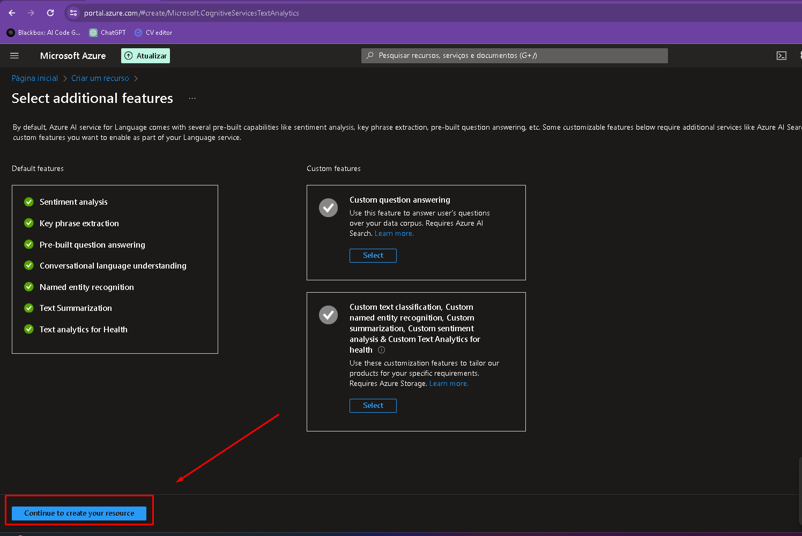
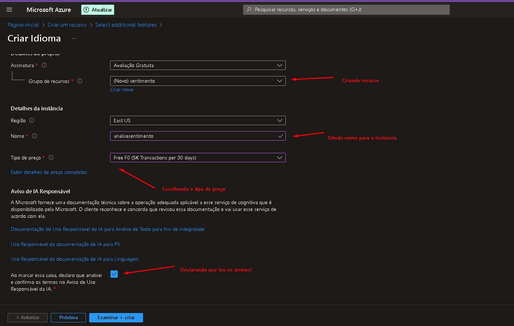
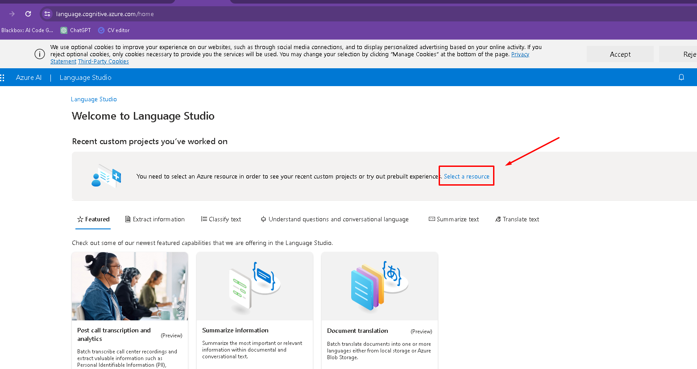
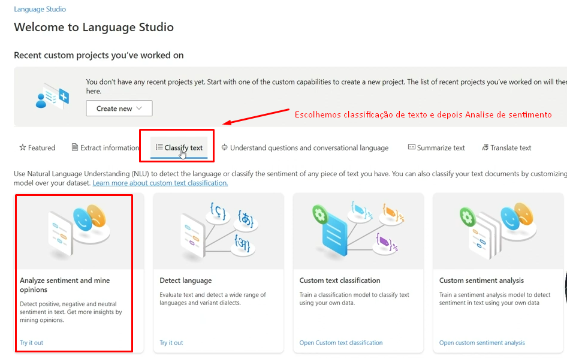
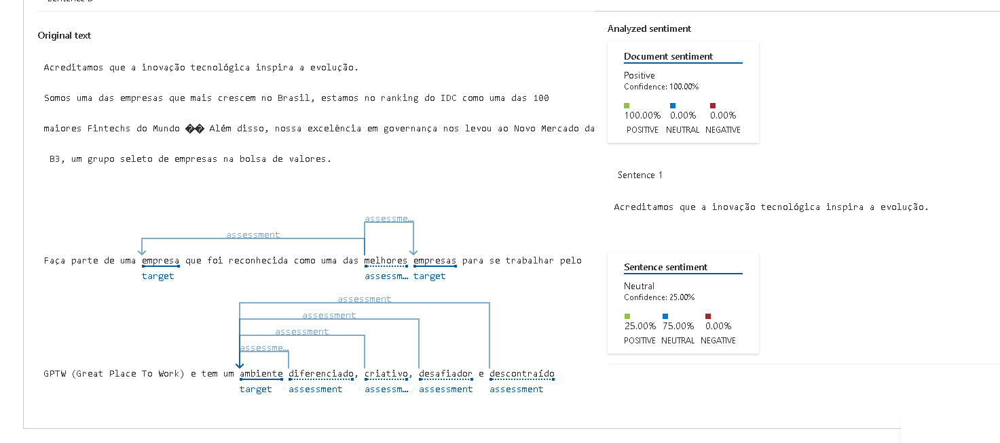
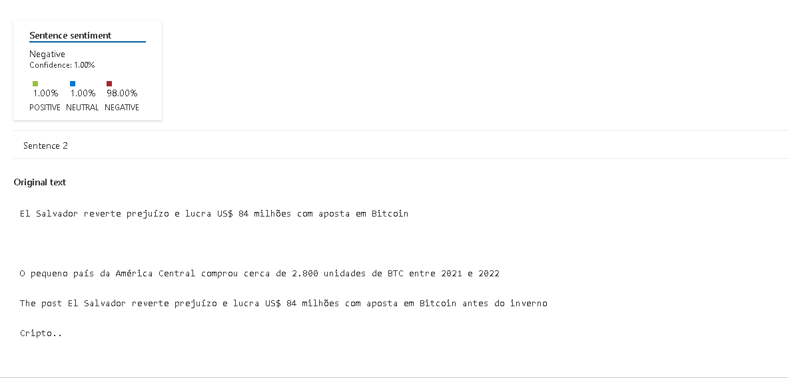

# Azure---Language-Studio
LAb 04 - Analise de Sentimento, com  Language Studio

Projeto utilizando Ferramenta poderosa no Azure Cloud. Estamos falando do Azure Language Studio e o portal de Serviços Cognitivos vinculados ao Azure.

## Como chegar lá?

Acesse o [Azure](https://azure.com) e logue com sua conta. Caso não tenha crie uma gratuita.

* Caso precise criar uma conta gratuita, será necessário informar um cartão de credito válido. A microsoft libera um credito para você usar dentro do azure, mas fica com um cartão caso haja excessos.

* Assim que acessar o Portal do Azure, clique em "Criar um recurso" e depois no menu a esquerda, clique em "IA + Machine Learning" e por ultimo na segunda opção "Análise de texto".

Em seguida, Crie um novo recurso, caso não tenha um e selecione o tipo de preço F0 e tique a caixa abaixo, conforme figura abaixo.

Recurso criado, vamos para o portal do [Language Studio](https://portal.language.cognitive.azure.com/).

Faça o login com sua conta gratuita ou não, criada la no portal Azure.

Conectado ao Language Studio, clique em "Selecionar Recurso":

Na pagina de "all Resources", selecione o recurso criado anteriormente, conforme imagen abaixo:

Apos o passo acima, estamos prontos para usar dois recuros:*   

*   Utilizaremos a "Classificação de Texto" e em Seguida "Analise de sentimento"

## Ex 1 - Recohecendo texto de Apresentação de Empresa

Empresa recrutando DEv´s, começa sua vaga como é trabalhar nela e se você combina com descrição, para se inscrever para vaga.

Vejamos o resultado da analise de sentimento.

O primeiro texto foi dividido em 3 sentenças, e o resultado do documento como um todo, pode ser visto com 100% positivo.

O resultado esta abaixo:

| Positivo   | Neutro       | Negativo        |Descrição
| :---------- | :--------- |:--------- | :---------------------------------- |
| 25%` | 75% | 0% | **Sentença1** |
| 36% | 64%| 0% | **Sentença2** |
| 100% | 0% | 0% | **Sentença 3** |

## Ex 2 - Noticia sobre lucros com valorização do Bitcoin

Para a noticia sobre BTV (Bitcoin), pelo momento vivido (12/03/2024), não tinha duvidas que o documento e ambas sentenças seriam positivas. MAs desta vez, tanto o documento e as setenças ficaram com 100% de avaliação positivo.

Todos os pintos, pode ser visualizado na pasta "output".
Os dois textos utilizados podem ser visualizado na pasta "inputs".

Há outros exemplos nas pastas inputs e output para análise ou mesmo para uso no [Language Studio](https://portal.language.cognitive.azure.com/)
## Insights 

O uso de Ferramentas de IA podem ser muito amplas e benéficas caso utilizdas de forma correta.

A análise de sentimento pode vir a calhar em melhorias de processos como um todo. Por exemplo, eu trabalho em uma grande empresa, e sempre que tentanmos escutar o usuario, eu sinto que o mesmo nao nos conta tudo o que ele acredita que seja melhor para uma determinada atividade e ficar na dependeica da imaginação de quem vai operacionar algo que ainda nao sabe, fica muito dificil. Com a analise de sentimento em pesquisas, anonimas, o colaborador pode passar valiosas informações, negativas ou não, podendo assim orientar melhor a tomada de decisões em:

    * Planejamento Estrategico;

    * Automatizações de tarefas;

    * Novos desenvolvimentos;

Além disso se sairmos para o mundo afora, podemos realmente entender em como melhorar o atendimento aos nossos clientes.

Outro insight valiosos, poderia ser na área de finanças e investimento. Desde que configurada e parametrizada, a Análise de sentomento poderia guiar investimentos financanceiros a modo de tentar minimizar os riscos. Alias com análises estatisicas e matemáticas mas com um pouco do que acontece no mundo pode afetar instituições/países, a ferramenta poderia indicar quando e como deveria sair ou entrar em determinados ativos.

## Referência

 - [Documentação Analise Sentimento](https://aka.ms/ai900-text-analysis)
 - [Portal Azure](https://portal.azure.com)
 - [Language Studio](https://portal.language.cognitive.azure.com)

## 😊Autores

- [@lerocha1](https://www.github.com/lerocha1)

## 🚀 Sobre mim
Pai, ciclista e apaixonado por Tecnologia, atuo como Gerente multidisciplinar em uma empresa de engenharia e que nas horas vagas "gasto" meu tempo com programação e desafios na internet.

Programando marjoritariamente em Python, também especialista em banco de Dados, Analise de dados/Big Data e programador FullStack.

